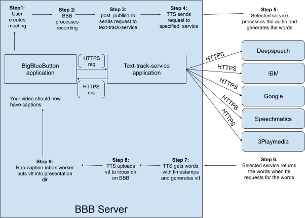

Bigbluebutton already has live captioning for its meetings but Text-Track-Service is a project to help bigbluebutton auto-generate captions for their videos using multiple paid and free services. This project aims to make the software more accessible to students/users with hearing disabilities. This makes it easier for students/users that want to go back to a class/meeting and see the video again with captions.
The documentation is for BigBlueButton admins that want to set up the text-track-service on a server already running with bigbluebutton to generate captions.

###### You can try it out here:- https://demo.bigbluebutton.org/
The video player will have a cc button. Click it and you should see captions for your video.

Here is a simple diagram of how it works:-


## Before install
You should have ssh access to a server with BigBlueButton already installed.

## Instructions to set up Text-track-service with IBM
---

### 1. Set up texttrack user on the server
We need to first set up a separate user for our text-track service.

Steps to set up
```
adduser texttrack
usermod -aG sudo texttrack
su texttrack (switch to texttrack user)
```
Steps to test
```
sudo ls -la /root
```
---

### 2. Set up docker on the server
Now we need to set up docker to make maintaining and updating the application easier.

Check if you have docker installed
```
docker --version
```

If you don't have docker installed please follow the steps given at [Docker install](https://docs.docker.com/install/linux/docker-ce/ubuntu/) for more information.

Steps to test
```
sudo docker run hello-world
```
---

### 3. Set up docker-compose on the server
Docker-compose is again just easier maintenance.

Steps to set up
Follow instructions at:- [Docker-compose install](https://docs.docker.com/compose/install/)

Steps to test
```
docker-compose --version
```
---

### 3. Add texttrack user to docker
Adding the texttrack user to docker will allow texttrack to access the files created by docker.
```
sudo usermod -a -G docker texttrack
```
---

### 4. Create dir & clone github repo
We need to install git in order to clone our application from Github.

Steps to set up
```
sudo apt update
sudo apt install git
```

Steps to test
```
git --version
```

Now that we are set up with what we need, we can now clone the application from the github repo.
Clone repo
```
cd /var
sudo mkdir docker
sudo chown texttrack:textrack /var/docker
cd docker
git clone https://github.com/bigbluebutton/text-track-service
cd text-track-service
```
---

### 5. Set up credentials(IBM) & test

The installation instructions are for IBM if you want to use another service visit this link: [Google Docs services](https://docs.google.com/document/d/e/2PACX-1vQu9o5q1tdf84cPo8kn6vt8QvhyuYJKdhLBVNIeuIHBwpxdRqWu0bmIgHsm8z5dU6YIjoZeDHxwSHu2/pub)
Follow instructions for setting up the service you want.

Steps to set up:

sign up to IBM at: [Ibm sign-up](https://dataplatform.cloud.ibm.com/docs/content/wsj/getting-started/signup-wdp.html)
After signing in you should be able to see the dashboard.  Click on Watson in the left menu.
Click on get started (convert audio into text) then you can give service name and/or tag name here. And select the blue create button in the right panel.
You can give the service name of your choice. Then click create.
Click on manage in the left panel and you will be able to see your credentials.

Save your apikey & url given.


In order to test your IBM credentials we have a `audio_temp.flac` file for you to test with in `/var/docker/text-track-service/test_dir`
Steps to test

once you have your IBM api_key & url open terminal and do the following:
(make sure to replace {apikey} & {url} with your credentials)
```
cd /var/docker/text-track-service/test_dir

curl -X POST -u "apikey:{apikey}" \
--header "Content-Type: audio/flac" \
--data-binary @audio_temp.flac \
"{url}/v1/recognize"

```
---

### 6. Add your service credentials in credentials.yaml file
Now that you have signed up to a service we need to tie that service with the application using your account. After you copy example-credentials as credentials it already has placeholders for all services based on what
information is needed. Edit your information in and make sure you have all information need by that service.

Steps to set up
```
cp example-credentials.yaml credentials.yaml
```
Now edit your information in `credentials.yaml` (you can refer example-credentials.yaml file in `/var/docker/text-track-service`)

(extra step for google account)
create `auth/google_auth_file.json` and add file name to `credentials.yaml` (make sure google auth file owner is texttrack)
---

### 7. Set up systemd files
Now we want to set up the application to start, stop and restart by itself, so we are going to set up some systemd files to do that for us.

Steps to set up
```
cd /var/docker/text-track-service/systemd
sudo cp tts-docker.service /etc/systemd/system
sudo systemctl enable tts-docker

sudo chmod -R a+rX /var/docker/text-track-service/tmp/*

sudo systemctl start tts-docker
```

Steps to test
```
sudo journalctl -u tts-docker -f (see tailed logs)
```

Expected Result:
You should get the following result: `ActiveRecord::NoDatabaseError: FATAL:  database "myapp_development" does not exist`
---

### 8. Open new terminal to set up new db
Now we need to fix the error we got for no database. In a new terminal launch the commands below to set up your database.

Steps to set up
```
cd /var/docker/text-track-service
sudo rm -R tmp/db

sudo chmod -R a+rX tmp/*
sudo chmod -R a+rX *
sudo docker-compose exec --user "$(id -u):$(id -g)" website rails db:create

sudo chmod -R a+rX tmp/*
sudo chmod -R a+rX *
sudo docker-compose exec --user "$(id -u):$(id -g)" website rails db:migrate
```

Add the following line to the end of the visudo file:
```
sudo visudo
texttrack ALL = NOPASSWD: /var/docker/text-track-service/deploy.sh
```
Save and close the file
```
cd /var/docker/text-track-service
./deploy.sh
```

Steps to test
```
sudo journalctl -u tts-docker -f 
```
(You should no longer get a no db error)

Expected Result:

After creating databse now you should see lines that say your database has been created similar to: 
```
 (200.3ms)  CREATE DATABASE "myapp_development" ENCODING = 'unicode'
  ↳ bin/rails:11
Created database 'myapp_development'
   (103.8ms)  CREATE DATABASE "myapp_test" ENCODING = 'unicode'
  ↳ bin/rails:11
Created database 'myapp_test'
```

After migrating database you should see output similar to:
```
(21.9ms)  CREATE TABLE "schema_migrations" ("version" character varying NOT NULL PRIMARY KEY)
  ↳ bin/rails:11
   (11.6ms)  CREATE TABLE "ar_internal_metadata" ("key" character varying NOT NULL PRIMARY KEY, "value" character varying, "created_at" timestamp NOT NULL, "updated_at" timestamp NOT NULL)
  ↳ bin/rails:11
   (0.5ms)  SELECT pg_try_advisory_lock(7864839756650184315)
  ↳ bin/rails:11
   (0.7ms)  SELECT "schema_migrations"."version" FROM "schema_migrations" ORDER BY "schema_migrations"."version" ASC
  ↳ bin/rails:11
Migrating to CreateCaptions (20190709150627)
   (0.2ms)  BEGIN
  ↳ bin/rails:11
== 20190709150627 CreateCaptions: migrating ===================================
-- create_table(:captions)
   (11.5ms)  CREATE TABLE "captions" ("id" bigserial primary key, "record_id" character varying, "service" character varying, "status" character varying, "caption_locale" character varying, "error" character varying, "bbb_url" character varying, "bbb_checksum" character varying, "kind" character varying, "label" character varying, "processtime" character varying, "start_time" character varying, "end_time" character varying, "created_at" timestamp NOT NULL, "updated_at" timestamp NOT NULL)
  ↳ db/migrate/20190709150627_create_captions.rb:6
   -> 0.0127s
== 20190709150627 CreateCaptions: migrated (0.0127s) ==========================

  ActiveRecord::SchemaMigration Create (0.4ms)  INSERT INTO "schema_migrations" ("version") VALUES ($1) RETURNING "version"  [["version", "20190709150627"]]
  ↳ bin/rails:11
   (1.9ms)  COMMIT
  ↳ bin/rails:11
  ActiveRecord::InternalMetadata Load (0.5ms)  SELECT  "ar_internal_metadata".* FROM "ar_internal_metadata" WHERE "ar_internal_metadata"."key" = $1 LIMIT $2  [["key", "environment"], ["LIMIT", 1]]
  ↳ bin/rails:11
   (0.1ms)  BEGIN
  ↳ bin/rails:11
  ActiveRecord::InternalMetadata Create (0.4ms)  INSERT INTO "ar_internal_metadata" ("key", "value", "created_at", "updated_at") VALUES ($1, $2, $3, $4) RETURNING "key"  [["key", "environment"], ["value", "development"], ["created_at", "2020-01-15 15:39:41.277333"], ["updated_at", "2020-01-15 15:39:41.277333"]]
  ↳ bin/rails:11
   (1.1ms)  COMMIT
  ↳ bin/rails:11
   (0.4ms)  SELECT pg_advisory_unlock(7864839756650184315)
  ↳ bin/rails:11
   (0.3ms)  SELECT "schema_migrations"."version" FROM "schema_migrations" ORDER BY "schema_migrations"."version" ASC
  ↳ bin/rails:11
```
---

### 9. Add info to bigbluebutton.yml file on bbb server
The application needs some information about the BigBlueButton server to put the captions back onto the bbb server. Update the `bigbluebutton.yml` file with the needed information.

```
cd /usr/local/bigbluebutton/core/scripts/
```

To find your secret: `bbb-conf -secret` (shared secret)
Set up tts-secret in credentials.yaml and then enter that in /usr/local/bigbluebutton/core/scripts/bigbluebutton.yml

```
sudo vim bigbluebutton.yml

presentation_dir: /var/bigbluebutton/published/presentation
shared_secret: secret
temp_storage: /var/bigbluebutton/captions
tts_shared_secret: {tts-secret}

```
---

### 10. Edit post_publish.rb & start rap-caption-inbox worker
Now finally we need the bbb server to send the caption request to text-track application. This is done by the post publish file, we already have one set up for you. Copy it onto your server and your requests can now be sent to the text-track application from bbb server.


```
cd /usr/local/bigbluebutton/core/scripts/post_publish/
```

Make sure you have ffmpeg installed:
```
sudo apt-get install ffmpeg
```

Make sure you have the following gems installed:
```
cd /usr/local/bigbluebutton/core/scripts/post_publish/
sudo gem install rest-client
sudo gem install speech_to_text
sudo gem install jwt
```

(Replace your post_publish.rb with the one in /var/docker/text-track-service)
```
sudo cp /var/docker/text-track-service/post_publish.rb root@your_server:/usr/local/bigbluebutton/core/scripts/post_publish  (use if bbb and text-track-service are running on different server)
sudo cp /var/docker/text-track-service/post_publish.rb /usr/local/bigbluebutton/core/scripts/post_publish  (use if bbb and text-track-service are running on same server)
```

To change the service you are using in post_publish.rb just add service name to the end of the request url(deepspeech is default)
```
request = RestClient::Request.new(
    method: :get,
    url: "http://localhost:4000/caption/#{meeting_id}/en-US/",
    payload: { :file => File.open("#{temp_storage}/#{meeting_id}/#{meeting_id}.wav", 'rb'),
               :token => token }
)

eg. http://localhost:4000/caption/#{meeting_id}/en-US/google
eg. http://localhost:4000/caption/#{meeting_id}/en-US/ibm
eg. http://localhost:4000/caption/#{meeting_id}/en-US/speechmatics
eg. http://localhost:4000/caption/#{meeting_id}/en-US/threeplaymedia
eg. http://localhost:4000/caption/#{meeting_id}/en-US/deepspeech or http://localhost:4000/caption/#{meeting_id}/en-US/ (deepspeech is default)
```

Also we need to set up rap caption inbox worker as the application only drops the captions in the inbox folder. The rap caption inbox worker will be the one to move them from inbox to the presentation dir so your video can finally have captions.

Text-Track-Service only drops the files in the inbox folder at `/var/bigbluebutton/captions/inbox`
Now the rap-caption-inbox.rb should move it to the presentation dir(`/var/bigbluebutton/published/presentation/<record-id>`) to start it run the foll command:
```
cd /var/docker/text-track-service
sudo cp rap-caption-inbox.rb /var/bigbluebutton/captions/inbox/rap-caption-inbox.rb (copy file from repo)
cd /var/bigbluebutton/captions/inbox

sudo chown root:root /usr/local/bigbluebutton/core/scripts/rap-caption-inbox.rb
sudo chmod ugo+x /usr/local/bigbluebutton/core/scripts/rap-caption-inbox.rb
sudo systemctl start bbb-rap-caption-inbox.service
```
---

### 11. Record a meeting and check for vtt
Finally make a recording/meeting on your server.
Look at the logs to make sure it processes successfully(`sudo journalctl -u tts-docker -f`)
Check the presentation folder of the record_id to see if a vtt file was generated. This can be found at (`/var/bigbluebutton/published/presentation/<record_id>`)
If there is a vtt file you have successfully transcribed your first meeting using IBM.

Your video should now have captions.
---

## Troubleshooting
If you followed Step 7 your should be able to see tailed logs with the following command
```
sudo journalctl -u tts-docker -f
```
fix any errors shown and then re-deploy by running `deploy.sh` in the root folder


* If the logs do not show any errors but you are missing the vtt file in the presentation folder check the inbox folder at `/var/bigbluebutton/captions/inbox/` (You should see a json and txt file.)
* This means that the text track has done its job and the rap caption worker is not moving the files to the right location.
* To fix this you can copy the `rap-caption-inbox.rb` file from the repo to your bbb server at `/usr/local/bigbluebutton/core/scripts/` & make sure the owner is root.
* Last step is make sure the `rap-caption-work.rb` has correct execute permissions if not just run the following command:
```
sudo chmod ugo+x /usr/local/bigbluebutton/core/scripts/rap-caption-inbox.rb
sudo systemctl start bbb-rap-caption-inbox.service
```
---

## Other services
Here is a link to a google docs for signing up to the services: [Google Docs services](https://docs.google.com/document/d/e/2PACX-1vQu9o5q1tdf84cPo8kn6vt8QvhyuYJKdhLBVNIeuIHBwpxdRqWu0bmIgHsm8z5dU6YIjoZeDHxwSHu2/pub)
To use other services you need to edit `credentials.yaml` file with the details required
Reference `example-credentials.yaml` for needed information
Finally edit `post_publish.rb` to use the new selected service as discussed in Step 10.
```
sudo vim /usr/local/bigbluebutton/core/scripts/post_publish/post_publish.rb
On line 113 add ibm or the service you want to (http://localhost:4000/caption/#{meeting_id}/en-US/) to the end of the line eg. http://localhost:4000/caption/#{meeting_id}/en-US/ibm
save & exit
```
To set up your own deepspeech server follow instructions at: [Github deepspeech-web](https://github.com/bigbluebutton/deepspeech-web)

## Install & use api commands for information
We can now set up api commands that will give us all the information about the recordings processed by the application.

Install api commands
```
cd /var/docker/text-track-service/commands
./config.sh (run api config file)
```
you can now use the commands from anywhere in the terminal as long as you are ssh into the server


Api usage:

| Command                 | Result                                                          |
| ----------------------- | --------------------------------------------------------------- |
| tts-all                 | shows list of all record-ids sent to the text-track-service     |
| tts-processed           | list of all successfully processed record-ids                   |
| tts-failed              | list of all failed to process record-ids                        |
| tts-record <record_id>  | get data for specific record_id                                 |
| tts-delete <record_id>  | delete data about a specific recording from text-track-service  |
| tts-delete-all          | delete all data about recordings from text-track-service        |

